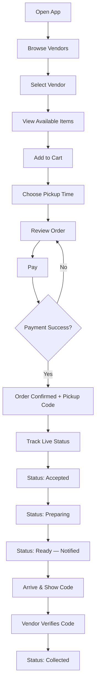
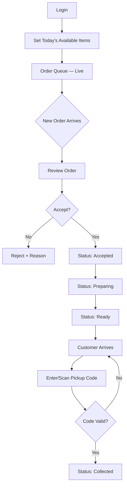
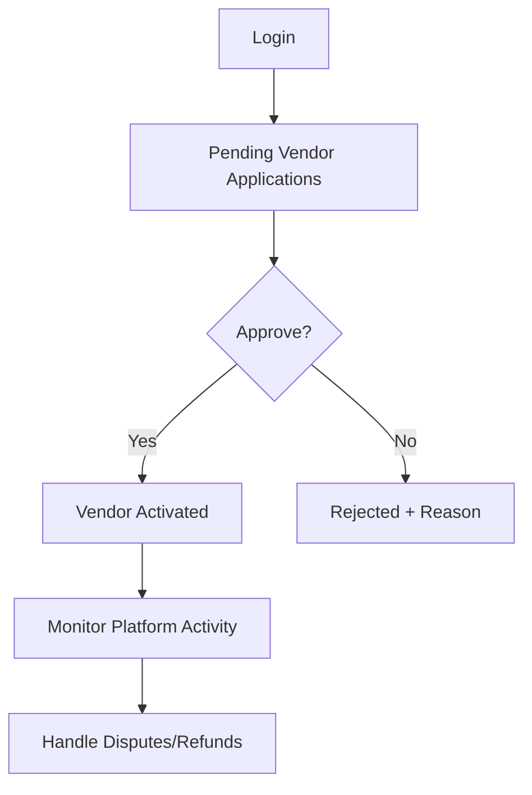

# App Flow Document
## Food Booking System

Describes the end-to-end flow for each role. Diagrams use Mermaid syntax (renders natively on GitHub and most Markdown viewers).

---

## 1. Customer Flow

### Narrative
1. Customer opens the app (PWA) → lands on vendor discovery/home screen
2. Browses list of open vendors (shows open/closed status, estimated prep time)
3. Selects a vendor → sees currently available items only (sold-out items hidden or greyed out)
4. Adds item(s) to cart — single vendor per order
5. Proceeds to checkout → selects a pickup time (slot-based, pending ADR-001)
6. Reviews order summary and total
7. Pays (method pending ADR-002)
8. Receives order confirmation with a pickup code and live status
9. Gets notified as status changes: Accepted → Preparing → Ready
10. Arrives at vendor, shows/states pickup code
11. Vendor verifies code → order marked Collected → done

### Diagram


### Edge cases to design for
- Item goes sold-out while customer is mid-checkout → block at payment step with clear message, not silently
- Payment fails → cart preserved, customer can retry
- Customer doesn't show up by end of pickup window → order auto-transitions to `No-show` after a grace period
- Customer wants to cancel → allowed only before vendor marks `Preparing` (configurable cutoff)

---

## 2. Vendor Flow

### Narrative
1. Vendor (or delegate) logs into vendor dashboard
2. Sets today's available items (or toggles pre-set items on/off) and quantities
3. New order arrives → real-time notification/sound + appears in order queue
4. Reviews order → Accepts or Rejects (with reason)
5. Marks order Preparing when work starts
6. Marks order Ready when packaged
7. Customer arrives → vendor enters/scans pickup code
8. System verifies code → marks Collected
9. Vendor can view a running list of today's orders and a daily summary

### Diagram


### Edge cases to design for
- Vendor runs out of an item mid-service → one-tap "mark sold out," any pending orders for that item flagged for vendor attention
- Vendor needs to reject an already-accepted order (rare, e.g. equipment failure) → allowed with mandatory reason, triggers refund flow
- Multiple staff using the same vendor account simultaneously → order actions should be safe against double-handling (e.g. two staff both trying to accept the same order)

---

## 3. Admin Flow

### Narrative
1. Admin logs into admin panel
2. Reviews pending vendor applications
3. Approves or rejects, with any onboarding notes
4. Monitors platform-wide order volume and vendor activity
5. Handles disputes/refund escalations that vendors can't resolve directly

### Diagram


---

## 4. Cross-Cutting: Order State Machine

```mermaid
stateDiagram-v2
    [*] --> Pending
    Pending --> Accepted
    Pending --> Rejected
    Accepted --> Preparing
    Preparing --> Ready
    Ready --> Collected
    Ready --> NoShow: grace period expires
    Pending --> Cancelled: customer cancels
    Accepted --> Cancelled: customer cancels (if before cutoff)
    Collected --> [*]
    Rejected --> [*]
    NoShow --> [*]
    Cancelled --> [*]
